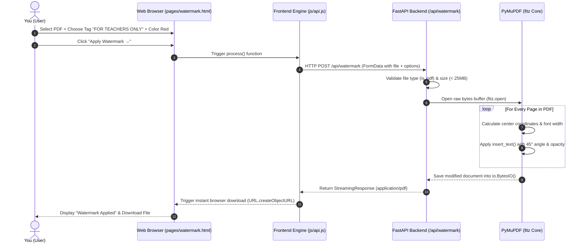

# PDF Watermark & Security Engine — Module Presentation & Code Defense Guide

This file is a dedicated technical breakdown of the **PDF Watermark & Document Security Module**. Use this file as your step-by-step presentation notes when demonstrating and explaining this module to your teachers.

---

## 🎯 Module Overview

* **Module Name:** PDF Watermark & Document Security Engine
* **Purpose:** Allows users to apply custom text watermarks, security notices, and status stamps (e.g. `CONFIDENTIAL`, `FOR TEACHERS ONLY`, `DRAFT`) onto any PDF document.
* **Key Innovation:** Uses real-time **in-memory vector text insertion** via PyMuPDF. Text is drawn directly over PDF content streams without saving any temporary files to disk or degrading original document quality.

---

## 📊 Module Architecture & Execution Flow



---

## 🗣️ Exact Presentation Script for Teachers (Read/Follow This)

### 1. Introduction (30 Seconds)
> "Teachers, today I am presenting the **PDF Watermark & Security Engine Module**.
> 
> Document security and confidentiality are major concerns when sharing digital PDFs. This module allows users to stamp security tags like `CONFIDENTIAL`, `DRAFT`, or `FOR TEACHERS ONLY` across any multi-page PDF document in seconds, with customizable rotation, opacity, and color."

### 2. Technical Architecture & Memory Model (45 Seconds)
> "From a technical standpoint, this module runs completely **in-memory**:
> 1. The user selects options on our custom HTML5 page [pages/watermark.html](file:///d:/Download/NextGen-PDF-Launch-Ready-V1/nextgen/pages/watermark.html).
> 2. The client script [js/api.js](file:///d:/Download/NextGen-PDF-Launch-Ready-V1/nextgen/js/api.js#L164) packs the file and parameters into a `FormData` object and POSTs to our FastAPI backend endpoint `/api/watermark`.
> 3. In the backend [backend/main.py](file:///d:/Download/NextGen-PDF-Launch-Ready-V1/nextgen/backend/main.py#L274), the uploaded file bytes are passed into Python's `io.BytesIO` buffer. **No temporary files are ever created on disk**, ensuring 100% user data privacy."

### 3. Algorithm & Vector Text Overlay (45 Seconds)
> "To render the watermark, we use **PyMuPDF (`fitz`)**:
> - We calculate the dimensions of each page (`rect.width`, `rect.height`) and calculate font width using `fitz.get_text_length()`.
> - For diagonal 45° watermarks, we apply geometry calculations `(w - text_length * 0.7) / 2` to position the origin point perfectly at the page center.
> - We call `page.insert_text()`, specifying text angle, RGB color tuple, font size, and `fill_opacity`.
> - The final PDF stream is returned as an HTTP `StreamingResponse` for direct download."

---

## 🔍 Line-by-Line Code Explanation for Teachers

When your teachers ask to open and see the code, open these exact files and explain these lines:

### 1. Backend Endpoint: `backend/main.py`
📍 **File Location:** [backend/main.py (Line 274)](file:///d:/Download/NextGen-PDF-Launch-Ready-V1/nextgen/backend/main.py#L274)

```python
# 1. Define async endpoint with Multipart Form parameters
@app.post("/api/watermark")
async def watermark_pdf(
    file: UploadFile = File(...),
    text: str = Form("CONFIDENTIAL"),
    position: str = Form("diagonal"),
    color: str = Form("red"),
    opacity: float = Form(0.35),
    fontsize: int = Form(48),
):
    # 2. File Validation & Limit Check
    if not is_pdf(file):
        raise HTTPException(415, "Please upload a PDF file.")
    data = await file.read()
    reject_large(data)  # Enforces 25MB maximum file limit

    # 3. RGB Color Mapping Dictionary
    color_map = {
        "red": (0.85, 0.15, 0.15),
        "blue": (0.15, 0.35, 0.85),
        "gray": (0.5, 0.5, 0.5),
        "green": (0.15, 0.65, 0.25),
    }
    rgb = color_map.get(color.lower(), (0.85, 0.15, 0.15))

    # 4. Open PDF stream in PyMuPDF (fitz)
    doc = fitz.open(stream=data, filetype="pdf")
    rotate_deg = 45 if position.lower() == "diagonal" else 0

    # 5. Iterate through all pages and apply vector watermark
    for page in doc:
        rect = page.rect
        w, h = rect.width, rect.height
        text_length = fitz.get_text_length(watermark_text, fontname="helv", fontsize=fontsize)

        # Center point math for 45-degree rotation vs horizontal
        if rotate_deg == 45:
            point = fitz.Point((w - text_length * 0.7) / 2, (h + text_length * 0.7) / 2)
        else:
            point = fitz.Point((w - text_length) / 2, h / 2)

        # Vector text insertion with opacity blending
        page.insert_text(
            point,
            watermark_text,
            fontname="helv",
            fontsize=fontsize,
            color=rgb,
            fill_opacity=opacity,
            rotate=rotate_deg,
            overlay=True
        )

    # 6. Stream processed PDF bytes back to client
    buf = io.BytesIO()
    doc.save(buf, garbage=3, deflate=True)
    return file_response(buf.getvalue(), f"nextgen-{safe_stem(file.filename)}-watermarked.pdf", "application/pdf")
```

### 2. Frontend API Controller: `js/api.js`
📍 **File Location:** [js/api.js (Line 164)](file:///d:/Download/NextGen-PDF-Launch-Ready-V1/nextgen/js/api.js#L164)

```javascript
// Collects selected UI options and appends to FormData payload
if (tool === 'watermark') {
  const textVal = document.querySelector('#watermark-text')?.value.trim() || 'CONFIDENTIAL';
  form.append('text', textVal);
  form.append('position', selectedValue('[data-group="position"]', 'diagonal'));
  form.append('color', selectedValue('[data-group="color"]', 'red'));
  form.append('opacity', selectedValue('[data-group="opacity"]', '0.35'));
  form.append('fontsize', selectedValue('[data-group="fontsize"]', '48'));
}
```

### 3. Frontend Tool Page: `pages/watermark.html`
📍 **File Location:** [pages/watermark.html](file:///d:/Download/NextGen-PDF-Launch-Ready-V1/nextgen/pages/watermark.html)
* Contains semantic layout, preset pill tags (`CONFIDENTIAL`, `DRAFT`, `FOR TEACHERS ONLY`), and interactive option groups.

---

## ❓ Anticipated Teacher Questions on This Module & Winning Answers

### Q1: Why did you use PyMuPDF `insert_text()` instead of converting PDF pages to images?
> **Answer:** "Converting PDF pages to images (rasterization) increases file size significantly and makes existing text un-selectable. PyMuPDF's `insert_text()` adds the watermark as a native PDF vector overlay stream. This keeps file sizes tiny, preserves sharp printing quality, and leaves the underlying PDF text fully intact and selectable."

### Q2: How does the opacity setting work?
> **Answer:** "PyMuPDF supports PDF Extended Graphic States (`fill_opacity`). When setting `fill_opacity=0.35`, the engine applies alpha-blending transparency to the text font stream, allowing original document text and graphics underneath the watermark to remain perfectly readable."

### Q3: How do you prevent memory leaks when processing large PDF files?
> **Answer:** "We call `doc.close()` inside a `try...finally` or immediately after `doc.save(buf)` to release PyMuPDF C-level pointers. Python's `io.BytesIO` buffer is automatically garbage-collected after the HTTP response stream is delivered."

---

## ⚡ Quick Reference Links for Live Presentation

| Component | Code Location | Key Line |
| :--- | :--- | :--- |
| **Backend Watermark Endpoint** | [backend/main.py](file:///d:/Download/NextGen-PDF-Launch-Ready-V1/nextgen/backend/main.py#L274) | Line 274 (`@app.post("/api/watermark")`) |
| **Frontend API Controller** | [js/api.js](file:///d:/Download/NextGen-PDF-Launch-Ready-V1/nextgen/js/api.js#L164) | Line 164 (`tool === 'watermark'`) |
| **Watermark UI Workspace** | [pages/watermark.html](file:///d:/Download/NextGen-PDF-Launch-Ready-V1/nextgen/pages/watermark.html) | Whole page UI |
| **Master Presentation Guide** | [PROJECT_PRESENTATION_GUIDE.md](file:///d:/Download/NextGen-PDF-Launch-Ready-V1/nextgen/PROJECT_PRESENTATION_GUIDE.md) | Section 4 & Section 8 |

---

*You are now fully equipped to explain and defend the PDF Watermark Engine Module in front of your teachers!*
