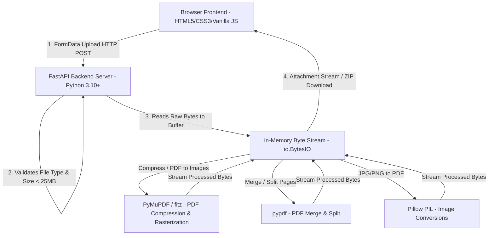

# NextGen PDF — Project Presentation & Teacher Defense Guide

This comprehensive guide is designed to help you confidently present **NextGen PDF** in front of your teachers, project evaluators, or viva examiners. It covers everything from project architecture and code highlights to a step-by-step speaking script and anticipated Q&A.

---

## 📋 Table of Contents
1. [Executive Project Summary](#1-executive-project-summary)
2. [Key System Architecture & Data Flow](#2-key-system-architecture--data-flow)
3. [Technology Stack & Key Libraries](#3-technology-stack--key-libraries)
4. [Core Features & Technical Highlights](#4-core-features--technical-highlights)
5. [Step-by-Step Presentation Script (3–5 Minutes)](#5-step-by-step-presentation-script-35-minutes)
6. [Live Demonstration Script (Step-by-Step Demo)](#6-live-demonstration-script-step-by-step-demo)
7. [Teacher Questions & Model Answers (Viva / Q&A Prep)](#7-teacher-questions--model-answers-viva--qa-prep)
8. [Codebase Reference & File Map](#8-codebase-reference--file-map)

---

## 1. Executive Project Summary

* **Project Name:** NextGen PDF
* **Type:** Full-Stack Web Application (Frontend + RESTful API Backend)
* **Problem Statement:** Most online PDF converters are slow, bloated with pop-up ads, enforce strict free-tier limits, or compromise user privacy by saving uploaded documents onto permanent disk storage.
* **Solution:** **NextGen PDF** provides a fast, lightweight, and **privacy-first** online PDF utility suite. All processing occurs **strictly in-memory** using streaming byte buffers (`io.BytesIO`). Files are processed on-the-fly and streamed back directly to the client browser without permanent disk storage.

---

## 2. Key System Architecture & Data Flow

### Architecture Diagram

### Data Flow Explanation for Teachers:
1. **Client Request:** The user selects or drags files onto the UI. JavaScript constructs a `FormData` object containing files and user options (e.g., compression level, page split range).
2. **REST Request:** The request is sent via HTTP POST to the FastAPI backend (e.g., `/api/compress`, `/api/merge`).
3. **In-Memory Processing:** The backend reads the byte stream directly into memory (`io.BytesIO`). **No temporary files are written to hard disk storage**.
4. **Tool Engine Processing:**
   - **PyMuPDF (`fitz`)** handles high-performance compression & vector-to-raster conversions.
   - **`pypdf`** handles lossless page extraction and merging.
   - **`Pillow`** handles layout fitting, resizing, and PDF generation from images.
5. **Streaming Response:** The output is wrapped in a `StreamingResponse` with appropriate `Content-Disposition` headers and streamed back to the browser for instant automatic download.

---

## 3. Technology Stack & Key Libraries

### Frontend
* **HTML5 & CSS3:** Semantic structure, CSS Grid/Flexbox layouts, dark theme aesthetic with modern gradient accents.
* **Vanilla JavaScript (ES6+):** Pure JavaScript for maximum performance without bloated framework overhead.
* **Fetch API & Blob Handling:** Handles asynchronous file uploads and binary response downloads (`URL.createObjectURL`).

### Backend
* **Python 3:** Core programming language.
* **FastAPI:** High-performance, asynchronous Python web framework built on Starlette and Pydantic.
* **PyMuPDF (`pymupdf` / `fitz`):** C-optimized PDF processing library for fast document manipulation, compression, and rendering.
* **pypdf (`PdfReader`, `PdfWriter`):** Pure Python library for page extraction, splitting, and merging.
* **Pillow (`PIL`):** Image manipulation library for image formatting, scaling, and canvas fitting.
* **Uvicorn:** Lightning-fast ASGI web server implementation.

---

## 4. Core Features & Technical Highlights

| Feature | Technical Implementation | Key Advantage |
| :--- | :--- | :--- |
| **PDF Compression** | Multi-tiered compression (`best`, `balanced`, `smallest`) utilizing PyMuPDF stream deflating, font cleaning, and optional smart rasterization for image-heavy PDFs. | Shrinks file size up to 80% while ensuring output size never grows larger than original. |
| **PDF Merge** | Reorders and combines up to 20 PDF files sequentially into a single unified document using `pypdf.PdfWriter`. | Instant re-ordering UI with drag-and-drop handles. |
| **PDF Split** | Parses custom range syntax (e.g., `1-3, 5, 7-9`) or single page splits. Packages multi-file outputs into a dynamically generated `.zip` file using `zipfile.ZipFile`. | Handles complex page ranges effortlessly. |
| **JPG / PNG to PDF** | Fits images to target page sizes (`portrait` or `landscape`) using Pillow's Lanczos anti-aliasing thumbnail engine with centered margins. | Clean layout without distorted image aspect ratios. |
| **PDF to JPG / PNG** | Converts PDF pages into crisp images using PyMuPDF matrix zoom (`fitz.Matrix(1.7, 1.7)`). | High resolution output (300+ DPI equivalent). |
| **PDF Watermarking** | Real-time text stamp overlay engine built with PyMuPDF `insert_text()`, calculating font width, rotation angles (45° diagonal / 0° horizontal), custom RGBA color mapping, and alpha opacity blending. | Instant document security marking without external desktop software. |
| **Privacy & Security** | CORS middleware restrictions, strict file type validation (`is_pdf`, `is_image`), 25MB file size safety checks (`reject_large`). | Complete user data privacy. No user file persistence. |

---

## 5. Step-by-Step Presentation Script (3–5 Minutes)

Here is a ready-to-use script you can memorize or follow during your project presentation:

### 🎙️ Introduction (30 Seconds)
> "Good morning/afternoon, teachers and evaluators. Today I am excited to present **NextGen PDF**, a high-performance, privacy-first web application designed for seamless PDF document manipulation.
> 
> Many existing online PDF tools suffer from intrusive advertisements, restrictive paywalls, and major security concerns because they upload and store user files on remote servers. NextGen PDF solves this by providing a clean UI coupled with an in-memory streaming backend that processes files instantly without saving them to disk."

### 🎙️ Architecture & Tech Stack (1 Minute)
> "Architecturally, NextGen PDF consists of two core components:
> 1. On the **frontend**, we use modern HTML5, responsive CSS, and Vanilla JavaScript. We purposefully avoided heavy framework dependencies to ensure fast page load speeds and zero client-side overhead.
> 2. On the **backend**, we built a RESTful API using **FastAPI** in Python. FastAPI was selected for its asynchronous performance, automatic request validation, and lightweight footprint.
> 
> For document processing, we integrated specialized Python libraries: **PyMuPDF** for high-speed PDF rendering and compression, **pypdf** for merging and splitting, and **Pillow** for image layout calculations."

### 🎙️ Key Technical Highlights (1 Minute)
> "Two major technical highlights set NextGen PDF apart:
> First, **In-Memory Buffer Processing**. Instead of writing uploaded files to disk storage—which creates security risks and disk I/O bottlenecks—our API reads file bytes directly into Python `BytesIO` memory buffers, processes them in memory, and streams the output directly back to the user.
> 
> Second, **Intelligent PDF Compression**. Our compression engine offers three levels. For image-heavy PDFs where standard stream deflating isn't enough, it automatically utilizes fallback matrix rasterization with JPEG quality scaling, guaranteeing that compressed files never end up larger than their originals."

### 🎙️ Live Demo (1.5 Minutes)
*(Refer to Section 6 for live demo steps)*

### 🎙️ Conclusion (30 Seconds)
> "In summary, NextGen PDF combines a sleek frontend with a secure, efficient Python backend. It handles file validation, multi-file drag-and-drop reordering, complex page-range splits, zip packaging, and memory streaming. Thank you for your time, and I am now open to your questions!"

---

## 6. Live Demonstration Script (Step-by-Step Demo)

Follow these exact steps when demonstrating the live app to your teachers:

1. **Launch the Application:**
   - Backend terminal: `uvicorn main:app --reload --host 127.0.0.1 --port 8000`
   - Frontend terminal: `python -m http.server 5500`
   - Open browser to `http://127.0.0.1:5500`.

2. **Demonstrate Merge PDF:**
   - Go to **Merge PDF** tool.
   - Drag & drop 2–3 sample PDF files.
   - Show how you can **reorder** the files using the drag handle or Up/Down arrows.
   - Click **Merge PDF**. Show the instant download response.

3. **Demonstrate Compress PDF:**
   - Go to **Compress PDF**.
   - Upload a sample PDF document.
   - Select **Balanced** or **Smallest Size**.
   - Click **Compress PDF**. Show the original file size vs compressed output size calculated by the backend headers (`X-Original-Bytes` & `X-Output-Bytes`).

4. **Demonstrate Split PDF:**
   - Go to **Split PDF**.
   - Upload a multi-page PDF.
   - Type a custom range: `1-2, 4`.
   - Click **Split PDF** and demonstrate that the backend automatically packages multi-page splits into a clean `.zip` archive.

---

## 7. Teacher Questions & Model Answers (Viva / Q&A Prep)

Here are the most common technical questions teachers ask during viva/project evaluations, along with ideal answers:

### Q1: Why did you choose FastAPI over Flask or Django?
> **Answer:** "Flask is synchronous by default and requires additional extensions for async performance, while Django is a heavy full-stack framework with an ORM that is unnecessary for a stateless tool API. FastAPI is built on ASGI (Starlette) and Pydantic, offering native asynchronous request handling, automatic OpenAPI documentation, high performance, and typed request validation."

### Q2: How does your application ensure user file privacy?
> **Answer:** "Privacy is guaranteed by architectural design. Uploaded files are converted into temporary binary buffers in memory (`io.BytesIO`) during the HTTP request lifecycle. Once the processed output is streamed back via `StreamingResponse`, Python's garbage collector frees the memory. No user documents are written to or saved on hard disk storage."

### Q3: What happens if a user uploads a file larger than 25MB or an invalid file format?
> **Answer:** "We implement validation on both frontend and backend:
> 1. On the frontend, `isAllowedFile()` inspects MIME types and extensions, disabling processing if invalid.
> 2. On the backend, `is_pdf()` / `is_image()` inspect file headers, and `reject_large()` raises a `HTTP 413 Payload Too Large` exception if the file size exceeds 25 MB (`MAX_FILE_SIZE`)."

### Q4: How do you handle PDF compression without losing document quality?
> **Answer:** "We use PyMuPDF's garbage collection and stream deflation options (`garbage=4, deflate=True, deflate_images=True`). This removes unused objects, duplicate streams, and uncompressed fonts while preserving vector graphics and text readability. If a document consists mostly of scanned images, we use matrix scaling with Pillow JPEG quality control."

### Q5: How does the application return multiple split PDF files to the user?
> **Answer:** "If a split operation results in a single PDF, the backend returns a single `application/pdf` stream. If it results in multiple PDFs, the backend utilizes Python's `zipfile.ZipFile` module to bundle all generated PDF buffers into an in-memory `.zip` archive (`application/zip`) on the fly."

### Q6: How does the frontend handle cross-origin requests (CORS)?
> **Answer:** "FastAPI's `CORSMiddleware` is configured to allow requests from designated frontend origins (`http://127.0.0.1:5500`, `localhost`, etc.). We also explicitly expose custom HTTP headers like `Content-Disposition`, `X-Original-Bytes`, and `X-Output-Bytes` so the frontend JavaScript can read file names and compression metrics."

### Q7: How would you scale this application for thousands of concurrent users?
> **Answer:** "To scale NextGen PDF:
> 1. Containerize the backend using Docker and deploy behind an Nginx load balancer across multiple Gunicorn/Uvicorn worker nodes.
> 2. Serve static frontend assets via a Content Delivery Network (CDN) like Firebase or Cloudflare.
> 3. Implement Redis rate-limiting to prevent API abuse."

---

## 8. Codebase Reference & File Map

Use this table to quickly open specific code files during your presentation when teachers ask to see the code:

| File Name | Direct File Link | Key Lines to Show Teachers |
| :--- | :--- | :--- |
| **FastAPI Core & Endpoints** | [backend/main.py](file:///d:/Download/NextGen-PDF-Launch-Ready-V1/nextgen/backend/main.py) | [Line 19: App setup](file:///d:/Download/NextGen-PDF-Launch-Ready-V1/nextgen/backend/main.py#L19), [Line 47: Memory File Response](file:///d:/Download/NextGen-PDF-Launch-Ready-V1/nextgen/backend/main.py#L47), [Line 88: Compression Endpoint](file:///d:/Download/NextGen-PDF-Launch-Ready-V1/nextgen/backend/main.py#L88), [Line 138: Merge Endpoint](file:///d:/Download/NextGen-PDF-Launch-Ready-V1/nextgen/backend/main.py#L138) |
| **Frontend API & Download Logic** | [js/api.js](file:///d:/Download/NextGen-PDF-Launch-Ready-V1/nextgen/js/api.js) | [Line 1: API Base URL](file:///d:/Download/NextGen-PDF-Launch-Ready-V1/nextgen/js/api.js#L1), [Line 25: Allowed File Check](file:///d:/Download/NextGen-PDF-Launch-Ready-V1/nextgen/js/api.js#L25), [Line 45: Drag & Drop List Render](file:///d:/Download/NextGen-PDF-Launch-Ready-V1/nextgen/js/api.js#L45) |
| **Main Landing Page** | [index.html](file:///d:/Download/NextGen-PDF-Launch-Ready-V1/nextgen/index.html) | Semantic layout, feature tool cards, hero banner |
| **Merge Tool Page** | [pages/merge.html](file:///d:/Download/NextGen-PDF-Launch-Ready-V1/nextgen/pages/merge.html) | Data attributes (`data-tool="merge"`), dropzone UI |
| **Compress Tool Page** | [pages/compress.html](file:///d:/Download/NextGen-PDF-Launch-Ready-V1/nextgen/pages/compress.html) | Compression tier radio options (`best`, `balanced`, `smallest`) |
| **Watermark Tool Page** | [pages/watermark.html](file:///d:/Download/NextGen-PDF-Launch-Ready-V1/nextgen/pages/watermark.html) | Interactive text presets, color palette, position & opacity options |
| **Watermark API Endpoint** | [backend/main.py](file:///d:/Download/NextGen-PDF-Launch-Ready-V1/nextgen/backend/main.py#L274) | PyMuPDF `insert_text()` vector stamp overlay & memory buffer streaming |
| **Deployment Setup** | [README.md](file:///d:/Download/NextGen-PDF-Launch-Ready-V1/nextgen/README.md) | Local run instructions & configuration flags |

---

*Good luck with your presentation! You are fully prepared to explain and defend NextGen PDF.*
